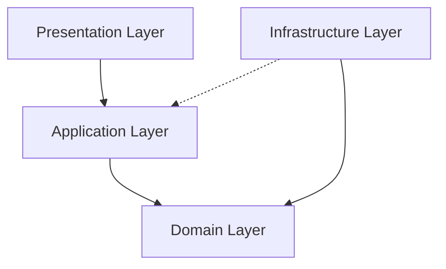

# Estructura de Carpetas: Módulo Auth (Arquitectura Hexagonal)

Esta documentación detalla la organización del módulo de autenticación siguiendo los principios de **Arquitectura Hexagonal** (Ports & Adapters) y las mejores prácticas de **Clean Architecture** aplicadas a Frontend (Angular).

## Visión General

El módulo `auth` se divide en cuatro capas principales que garantizan el desacoplamiento entre la lógica de negocio y los detalles tecnológicos (Firebase, LocalStorage, etc.).

---

## 1. Domain Layer (`domain/`)

Es el núcleo de la aplicación. No tiene dependencias externas y contiene las reglas de negocio puras.

### Estructura
- **`entities/`**: Objetos con identidad (ej. `user.entity.ts`, `token.entity.ts`). Representan los conceptos clave del dominio.
- **`models/`**: Estructuras de datos auxiliares o Value Objects (ej. `credentials.model.ts`, `auth-result.model.ts`).
- **`ports/`**: Define las interfaces de comunicación.
    - **`in/` (Inbound Ports)**: Interfaces que definen **qué puede hacer** el sistema (Casos de uso). Ej: `sign-in-with-email.in.ts`.
    - **`out/` (Outbound Ports)**: Interfaces que definen **qué necesita** el sistema del mundo exterior. Ej: `auth-repository.out.ts`.
- **`exceptions/`**: Errores específicos de negocio (ej. `auth.exceptions.ts`).
- **`factories/`**: Lógica para la creación de entidades complejas.

---

## 2. Application Layer (`application/`)

Orquesta los flujos de trabajo. Implementa los puertos de entrada (`in ports`) utilizando la lógica del dominio y servicios de infraestructura.

### Estructura
- **`usecases/`**: Implementaciones concretas de la lógica de aplicación. Cada archivo tiene una única responsabilidad (SRP).
    - *Ejemplo*: `sign-in-with-email.usecase.ts` implementa `SignInWithEmailIn`.
- **`stores/`**: Gestión del estado reactivo mediante **NgRx SignalStore**.
    - **`features/`**: Extensiones modulares del Store para mantenerlo limpio (ej. `sign-in-with-google.feature.ts`).
- **`states/`**: Definición de las interfaces que describen el estado de autenticación (`auth.state.ts`).

---

## 3. Infrastructure Layer (`infrastructure/`)

Contiene los detalles de implementación y adaptadores para herramientas externas.

### Estructura
- **`repositories/`**: Implementaciones concretas de los puertos de salida (`out ports`).
    - *Ejemplo*: `firebase-auth.repository.ts` implementa `AuthRepositoryOut`.
- **`mappers/`**: Traductores entre modelos de infraestructura (DTOs de Firebase/API) y entidades de dominio.
    - *Ejemplo*: Convierte un `User` de Firebase a nuestro `UserEntity`.
- **`providers/`**: Configuración de la Inyección de Dependencias (DI) de Angular para este módulo.

---

## 4. Presentation Layer (`presentation/`)

Todo lo relacionado con la interfaz de usuario y la interacción con el usuario.

### Estructura
- **`pages/`**: Componentes de tipo "Contenedor" (Smart Components). Se encargan de inyectar el Store y coordinar la vista.
    - *Rutas*: `sign-in/`, `register/`, `forgot-password/`.
- **`components/`**: Componentes "Presentacionales" (Dumb Components). Reciben datos vía `input()` y notifican vía `output()`.
- **`ui/`**: Componentes visuales pequeños y específicos del módulo.

---

## Resumen de Flujo

1. El usuario hace click en "Login" en `sign-in.page.ts`.
2. La página llama al método del `AuthStore`.
3. El `AuthStore` ejecuta un **Use Case** (`SignInWithEmailUseCase`).
4. El Use Case utiliza un **Port de Salida** (`AuthRepositoryPort`).
5. La **Infraestructura** (`FirebaseAuthRepository`) ejecuta la llamada real a Firebase.
6. El resultado se mapea de vuelta al dominio y el Store actualiza el estado.

> [!TIP]
> Esta estructura permite que si mañana decidimos cambiar Firebase por Auth0 o una API propia, **solo** tengamos que modificar la capa de **Infrastructure**, manteniendo el resto de la aplicación intacta.
